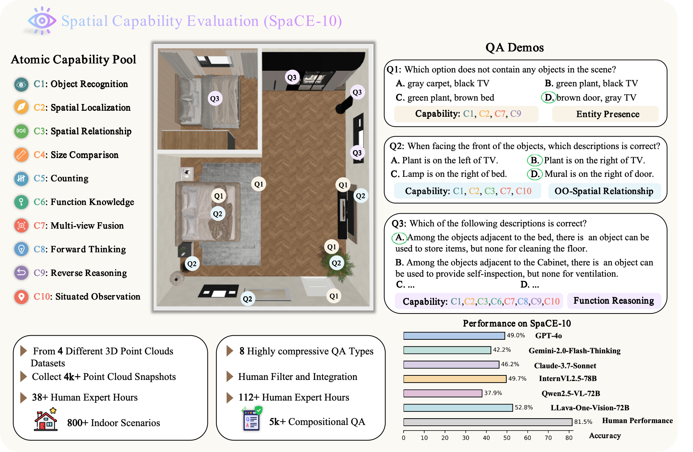

<div align="center">

<h1> SpaCE-10: A Comprehensive Benchmark for Multimodal Large Language Models in Compositional Spatial Intelligence</h1>

[Ziyang Gong](https://scholar.google.com/citations?user=cWip8QgAAAAJ)<sup>1*</sup>,
[Wenhao Li](https://scholar.google.com/citations?user=XXXXX)<sup>2*</sup>,
[Oliver Ma]()<sup>3</sup>,
[Songyuan Li](https://scholar.google.com/citations?user=XXXXX)<sup>4</sup>,
[Jiayi Ji](https://scholar.google.com/citations?user=XXXXX)<sup>5</sup>,
[Xue Yang](https://scholar.google.com/citations?user=XXXXX)<sup>1</sup>,
[Gen Luo](https://scholar.google.com/citations?user=XXXXX)<sup>3</sup>,
[Junchi Yan](https://scholar.google.com/citations?user=XXXXX)<sup>1</sup>,
[Rongrong Ji](https://scholar.google.com/citations?user=XXXXX)<sup>2</sup>

<sup>1</sup> Shanghai Jiao Tong University, 
<sup>2</sup> Xiamen University, 
<sup>3</sup> Shanghai AI Lab, 
<sup>4</sup> Sun Yat-sen University, 
<sup>5</sup> National University of Singapore

<sup>*</sup> Equal contribution

<!--  -->


<a href="#"></a>
<a href="https://huggingface.co/datasets/Cusyoung/SpaCE-10"></a>
</div>

<!-- <a href="#"></a> -->
<!-- <a href="#"></a> -->
---
# 🧠 What is SpaCE-10?

**SpaCE-10** is a **compositional spatial intellegence benchmark** for evaluating **Multimodal Large Language Models (MLLMs)** in indoor environments. It spans:

- ✅ 10 **atomic spatial capabilities**
- ✅ 8 **compositional QA types**
- ✅ 5,000+ QA pairs
- ✅ 811 indoor scenes (ScanNet++, ScanNet, 3RScan, ARKitScene)
<div align="center">
<br><br>

<br><br>
</div>


---
# 🔥 News
<!-- - 🤖 [2025/06/10] Baseline results with GPT-4o, InternVL, Claude-3, LLaVA and more are available. -->
- 📢 [2025/06/08] We have released the dataset and evaluation code.
---


<!-- SpaCE-10 emphasizes **scene generalization**, **compositional reasoning**, and **multi-view fusion** under open-vocabulary QA settings.

---

# 📦 Dataset

| Item | Details |
|------|---------|
| QA Pairs | 5,000+ |
| Scenes | 811 |
| Tasks | Atomic QA, Compositional QA |
| Modality | 3D Point Clouds + Language |
| Format | JSON + SceneMesh (.ply) |

> 📥 Download dataset and evaluation toolkit [here](https://huggingface.co/YOUR_ORG/SpaCE-10)

--- -->

<!-- # 🏁 Benchmark Capabilities

| Category       | Example Tasks                        |
|----------------|--------------------------------------|
| Atomic         | Relative position, orientation       |
| Compositional  | Scene planning, spatial chaining     |
| Reasoning Mode | Multiple-choice QA, point QA         |
| Modal Input    | 3D scene / multi-view / language     | -->

<!-- <p align="center">
  
</p> -->

<!-- --- -->

# Evaluation
Th

```bash
git clone https://github.com/YOUR_USERNAME/SpaCE-10.git
cd SpaCE-10
pip install -r requirements.txt
python run_eval.py --model gpt-4o
