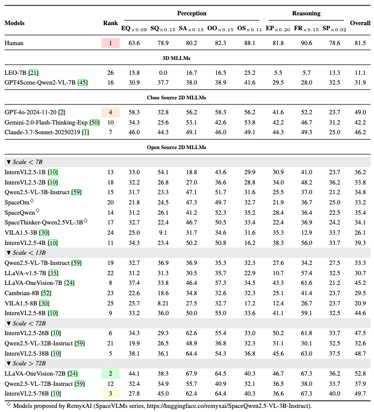

<div align="center">

<h1> SpaCE-10: A Comprehensive Benchmark for Multimodal Large Language Models in Compositional Spatial Intelligence</h1>

[Ziyang Gong](https://scholar.google.com/citations?user=cWip8QgAAAAJ&hl=zh-CN&oi=ao)<sup>1*</sup>,
[Wenhao Li]()<sup>2*</sup>,
[Oliver Ma]()<sup>3</sup>,
[Songyuan Li](https://scholar.google.com/citations?user=dVQGfEEAAAAJ&hl=zh-CN&oi=ao)<sup>4</sup>,
[Jiayi Ji](https://scholar.google.com/citations?user=xp_rICcAAAAJ&hl=zh-CN&oi=ao)<sup>5</sup>,
[Xue Yang](https://scholar.google.com/citations?user=2xTlvV0AAAAJ&hl=zh-CN)<sup>1</sup>,
[Gen Luo](https://scholar.google.com/citations?user=EyZqU9gAAAAJ&hl=zh-CN)<sup>3</sup>,
[Junchi Yan]()<sup>1</sup>,
[Rongrong Ji]()<sup>2</sup>

<sup>1</sup> Shanghai Jiao Tong University, 
<sup>2</sup> Xiamen University,  
<sup>3</sup> Shanghai AI Lab, 
<sup>4</sup> Sun Yat-sen University, 
<sup>5</sup> National University of Singapore

<sup>*</sup> Equal contribution


<a href="#"></a>
<a href="https://huggingface.co/datasets/Cusyoung/SpaCE-10"></a>
</div>

<!-- <a href="#"></a> -->
<!-- <a href="#"></a> -->
---
# 🧠 What is SpaCE-10?

**SpaCE-10** is a **compositional spatial intellegence benchmark** for evaluating **Multimodal Large Language Models (MLLMs)** in indoor environments. Our contribution as follows:

- 🧬 We define an **Atomic Capability Pool**, proposing 10 **atomic spatial capabilities.**
- 🔗 Based on the composition of different atomic capabilities, we design **8 compositional QA types**.
- 📈 SpaCE-10 benchmark contains 5,000+ QA pairs.
- 🏠 All QA pairs come from 811 indoor scenes (ScanNet++, ScanNet, 3RScan, ARKitScene)
- 🌍 SpaCE-10 spans both 2D and 3D MLLM evaluations and can be seamlessly adapted to MLLMs that accept 3D scan input.

<div align="center">
<br><br>

<br><br>
</div>


---
# 🔥🔥🔥 News
<!-- - 🤖 [2025/06/10] Baseline results with GPT-4o, InternVL, Claude-3, LLaVA and more are available. -->
- [2025/07/12] Adjust some QAs of Space-10 and update RemyxAI models' performance to leader board. 
- [2025/06/11] Scans for 3D MLLMs and our manually collected 3D snapshots will be coming soon.
- [2025/06/10] Evaluation code is released at followings.
- [2025/06/09] We have released the benchmark for 2D MLLMs at [Hugging Face](https://huggingface.co/datasets/Cusyoung/SpaCE-10).
- [2025/06/09] The paper of SpaCE-10 is released at [Arxiv](https://arxiv.org/abs/2506.07966v1)!
---


# Performance Leader Board - Single-Choice
🎉 LLaVA-OneVision-72B achieves the Rank 1 in all tested models.

🎉 GPT-4o achieves the best score in tested Close-Source models.

A large gap still exists between human and models in compositional spatial intelligence.


<div align="center">

<br>
</div>


# Capability Score Ranking - Single-Choice
<div align="center">

<br>
</div>


# Environment 
The evaluation of SpaCE-10 is based on lmms-eval. Thus, we follow the environment settings of lmms-eval.
```bash
git clone https://github.com/Cuzyoung/SpaCE-10.git
cd SpaCE-10
conda create -n space-10 --python=3.10 -y
conda activate space-10
pip install -e .
```

# Evaluation
Take InternVL2.5-8B as an example:
```bash
cd lmms-eval/run_bash
bash internvl2.5-8b.sh
```
Notably, each time we test a new model, the corresponding environment of this model needs to be installed.
---

# Citation
@article{gong2025space10,
  title={SpaCE-10: A Comprehensive Benchmark for Multimodal Large Language Models in Compositional Spatial Intelligence},
  author={Ziyang Gong, Wenhao Li, Oliver Ma, Songyuan Li, Jiayi Ji, Xue Yang, Gen Luo, Junchi Yan, Rongrong Ji},
  journal={arXiv preprint arXiv:2506.07966},
  year={2025}
}
